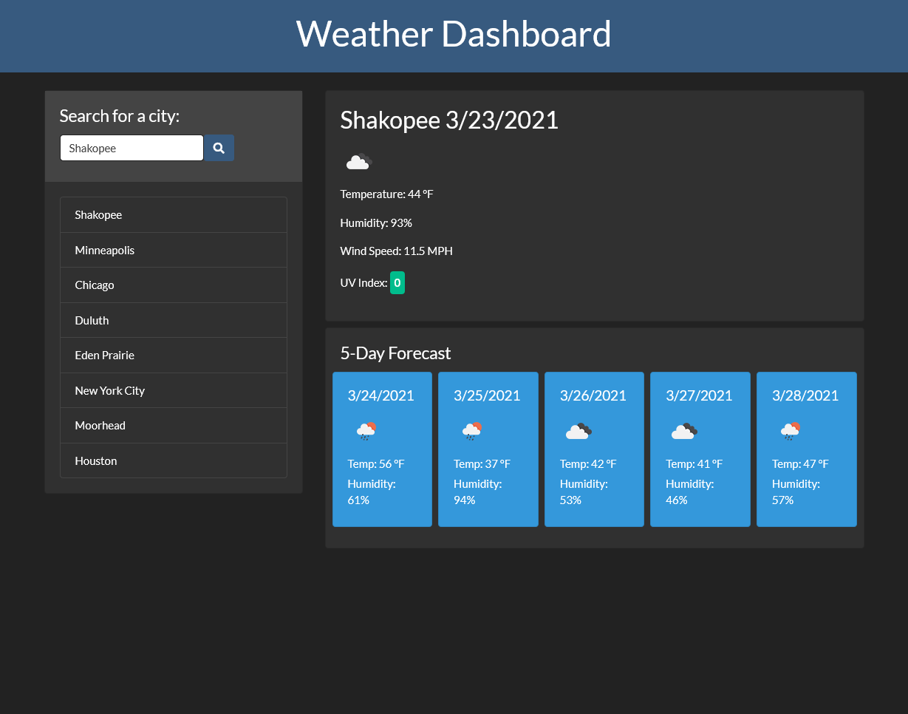

# weather-dashboard

## Description

This weather dashboard displays the current weather, along with the 5 day forecast.

Users can select what city they'd like to see, and it's added to the history.

Users can pick from their history to see the old data, or search the city again for an update.

City history is saved in localstorage.

## Site link

The link to the deployed application can be found **[https://nathanhentges.github.io/weather-dashboard/](https://nathanhentges.github.io/weather-dashboard/)**.

## Website preview

Below is a screenshot preview of the final website.

